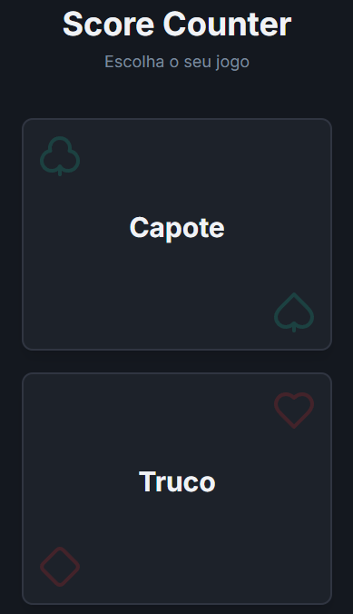
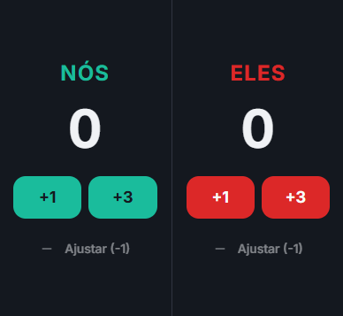
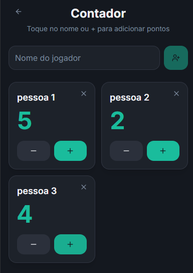

# Score Counter

Aplicativo simples e intuitivo para contagem de pontos em jogos de cartas e tabuleiro.


## 🎯 Visão Geral

**Score Counter** é um aplicativo mobile desenvolvido para facilitar a contagem de pontos em jogos, oferecendo uma interface simples, rápida e sem distrações. Atualmente suporta modos dedicados para **Truco** e **Capote**, eliminando a necessidade de papel e caneta.

Foi projetado para ser leve, funcionar offline e manter a tela do dispositivo ativa durante a partida para que você não perca nenhum lance.

## 📸 Screenshots

| Tela Inicial | Truco | Capote |
|-------------|-------|--------|
|  |  |  |


## ✨ Funcionalidades

- **Múltiplos Jogos:** Modos específicos para Truco e Capote.
- **Interface Intuitiva:** Design limpo e moderno focado na usabilidade.
- **Keep Awake:** Mantém a tela ligada durante o uso (evita bloqueio).
- **Funciona Offline:** Não requer conexão com a internet.
- **Responsivo:** Adaptado para diferentes tamanhos de tela.
- **Dark Mode:** Interface agradável visualmente (via sistema ou configuração).

## 🛠 Tecnologias

O projeto foi desenvolvido utilizando as tecnologias mais modernas do ecossistema React e Mobile:

- **Core:** [React](https://react.dev/) + [Vite](https://vitejs.dev/) + [TypeScript](https://www.typescriptlang.org/)
- **UI/Estilos:** [Tailwind CSS](https://tailwindcss.com/) + [Shadcn UI](https://ui.shadcn.com/)
- **Mobile:** [Capacitor](https://capacitorjs.com/) (Integração nativa iOS/Android)
- **Gerenciamento de Estado/Dados:** TanStack Query
- **Ícones:** Lucide React

## 📂 Estrutura do Projeto

```bash
src/
 ├─ components/     # Componentes reutilizáveis (UI Kit)
 ├─ hooks/          # Custom Hooks (Lógica compartilhada)
 ├─ lib/            # Utilitários e configurações (utils)
 ├─ pages/          # Telas do aplicativo (Home, Truco, Capote)
 ├─ App.tsx         # Componente raiz e rotas
 └─ main.tsx        # Ponto de entrada
```

## ▶️ Como Executar

### Pré-requisitos
- Node.js instalado (versão 18 ou superior recomendada)
- NPM ou Yarn

1. **Clone o repositório:**
   ```bash
   git clone https://github.com/eduardoehg/score-counter.git
   cd score-counter
   ```

2. **Instale as dependências:**
   ```bash
   npm install
   ```

3. **Execute o projeto (Modo Desenvolvimento Web):**
   ```bash
   npm run dev
   ```

## 📦 Build / Distribuição

Para gerar a versão nativa (Android/iOS) utilizando Capacitor:

1. **Gere o build web:**
   ```bash
   npm run build
   ```

2. **Sincronize com os projetos nativos:**
   ```bash
   npx cap sync
   ```

3. **Abra no Android Studio:**
   ```bash
   npx cap open android
   ```

## 🗺 Roadmap

- [ ] Histórico de partidas salvas localmente
- [ ] Voz do narrador para pontuação (Truco)
- [ ] Modo multiplayer local (Wi-Fi/Bluetooth)
- [ ] Temas personalizados

## 🤝 Contribuição

Contribuições são bem-vindas! Sinta-se à vontade para abrir **issues** para relatar bugs ou sugerir novas funcionalidades, e **pull requests** para melhorias diretas no código.

## 📄 Licença

Este projeto está sob a licença MIT.
Veja o arquivo [LICENSE](LICENSE) para mais detalhes.

---

## 👤 Autor

Desenvolvido por **Eduardo**  
🔗 GitHub: https://github.com/eduardoehg
